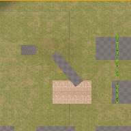

# Project Name  MDEV1003w24

## Description

A github repository for the in class demonstration code.   
 
## Usage
Clone, or download the zip, to a local directory. Open in Unreal Engine 5.3.2 or newer

## Attributions

1. audio, coin, NES Sounds by  Basto, Open Game Art, CC0, ( https://opengameart.org/content/nes-sounds )
2. audio,  Ove - Earth Is All We Have, OveMella, Open Game Art, CC-BY, ( https://opengameart.org/content/oves-essential-game-audio-pack-collection-160-files-updated )
3. Image, Snowy Field by Pixabay, Pexels.com, ( https://www.pexels.com/photo/snowy-field-during-golden-hour-259620/ )
4. Some models created with MakeHuman, ( http://www.makehumancommunity.org )
5. Some models rigged and animated with Adobe's Mixamo, ( https://www.mixamo.com/ )
6. Tree, EddeGraphics, SketchFab, ( https://skfb.ly/otuH6 )
7. Grass, EddeGrpahics, SketchFab, ( https://skfb.ly/otXxN )
8. Pine tree, EddeGraphics, SketchFab, ( https://skfb.ly/otuCO )
9. Brick wall, freePBR, ( https://freepbr.com/materials/worn-out-old-brick-wall-pbr-material/ )
10. Power up sound, MushroomKingdom.net, ( https://themushroomkingdom.net/sounds/wav/smw/smw_power-up.wav )

